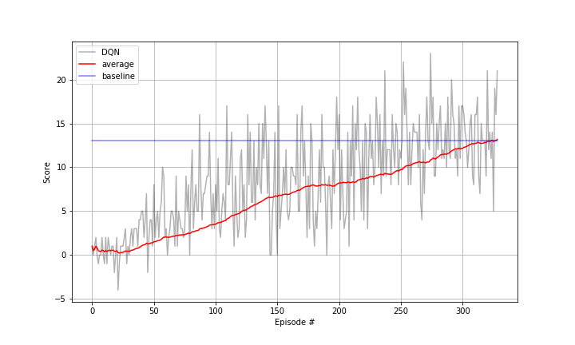

# Project Report

## Learning Algorithm

To solve this project `Deep-Q-Learning` algorithm was used. The details of the algorithm can be found in the paper given by DeepMind: [Human-level control through deep reinforcement learning](https://deepmind.com/research/publications/human-level-control-through-deep-reinforcement-learning/)

### Hyperparameters

The hyper-parameters used for the Agent model are:

```
BUFFER_SIZE = int(1e5)  # replay buffer size
BATCH_SIZE = 64         # minibatch size
GAMMA = 0.99            # discount factor
TAU = 1e-3              # for soft update of target parameters
LR = 5e-4               # learning rate 
UPDATE_EVERY = 4        # how often to update the network
```

The Epsilon values were as follows:

```
Initial: 1.0
Minimum: 0.02
Decay: 0.95
```

### Model Architecture

The model for the QNetwork is a simple fully connected network with 2 hidden layers:

```
(fc1): Linear(in_features=37, out_features=64, bias=True)
(fc2): Linear(in_features=64, out_features=64, bias=True)
(fc3): Linear(in_features=64, out_features=4, bias=True)
```
where (fc1) and (fc2) are followed by ReLU activation function.

## Plot of Rewards

The Agent was able to achieve the goal in 329 episodes. Following is the plot of scores corresponding to each episode:



## Future Work

* Apply following algorithms to compare with DQN: 
  - Double DQN
  - Dueling DQN
  - Prioritized Experience Replay
  - Learning from multi-step bootstrap targets (A3C)
  - Distributional DQN
  - Noisy DQN
* Use raw pixel based Banana Collector environment instead of using the current value based environment to apply above mentioned algorithms and compare their performance.
* Vary the hyper parameters, and compare the performance.